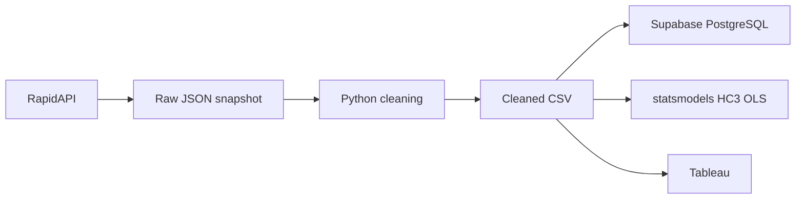

# Toronto Short-Term Rental Pricing Analyzer

The Toronto Short-Term Rental Pricing Analyzer is a compact analytics pipeline that extracts Airbnb-style search results through RapidAPI, cleans nested listing data, loads the curated snapshot into PostgreSQL, evaluates price relationships with statistical regression, and presents the results in Tableau.

**Stack:** Python · Pandas · PostgreSQL · Supabase · statsmodels · Tableau

## What problem does it solve?

The project examines how advertised short-term rental prices vary across listings returned from a Toronto-area search.

It turns nested API responses into a reproducible analytical dataset that supports three views of the same cleaned snapshot:

- SQL analysis in PostgreSQL
- statistical modeling in Python
- interactive geographic and category-level exploration in Tableau

The source reports advertised prices for five-night stays. The project analyzes listing prices rather than realized revenue, profit, or investment returns.

## Architecture



The regression and Tableau workbook read the cleaned dataset directly. PostgreSQL is a separate analytical consumer of the same curated snapshot.

## What the project demonstrates

- **API data extraction:** paginated requests, response validation, duplicate detection, and protection against publishing incomplete snapshots.
- **Data cleaning:** nested JSON parsing, discounted-price handling, fractional bathrooms, missing-value preservation, deterministic deduplication, and rejection reporting.
- **Relational analytics:** a PostgreSQL listings table plus `RANK()` and `AVG()` window calculations by bedroom category.
- **Statistical analysis:** multiple linear regression with HC3 robust standard errors, confidence intervals, and complete-case modeling.
- **Interactive BI:** a Tableau price map and bedroom-level price comparison built from the corrected listing snapshot.
- **Reproducibility:** environment-based credentials, a saved raw snapshot, schema definitions, focused tests, and a rerunnable local workflow.

## Saved Toronto-area snapshot

The saved API response contains **180 records**. Cleaning produces **149 unique listings**, removing **31 repeated listing IDs**.

The corrected dataset preserves incomplete information rather than replacing it with artificial values:

- **20 listings** have no observed bedroom count
- **23 listings** have no observed rating
- **26 listings** contain fractional bathroom counts

The source displays prices with a `$` symbol and the qualifier **“for 5 nights.”** Search dates vary across the snapshot, and the source does not provide an ISO currency code.

## Pricing model

The regression uses the **107 listings** with observed price, bedrooms, bathrooms, and rating.

The HC3 OLS model has **R² = 0.556**.

| Predictor | Coefficient | 95% confidence interval | p-value |
| --- | ---: | ---: | ---: |
| Bedrooms | 361.25 | −241.06 to 963.56 | 0.2398 |
| Bathrooms | 474.24 | −331.15 to 1,279.63 | 0.2485 |
| Rating | 380.40 | −1,438.69 to 2,199.49 | 0.6819 |

None of the three predictors is statistically significant at the **5% level** in the corrected model.

The coefficients describe conditional associations within this sample. They should not be interpreted as causal effects or as evidence that adding bedrooms, bathrooms, or improving ratings will generate a specific price increase.

A practical takeaway is to use bedroom count as a market-segmentation variable when comparing listings, while avoiding pricing or acquisition decisions based on these three features alone. Location, property type, seasonality, and accommodation type may also materially affect advertised price.

## Tableau dashboard

The Tableau dashboard presents two views of the corrected **149-listing** snapshot:

- **Advertised Price by Location:** a listing-level map using advertised price for mark size and colour
- **Average Advertised Price by Bedrooms:** a category comparison for listings with observed bedroom counts

The map retains listings with missing bedroom or rating metadata, while the bedroom comparison excludes unknown bedroom counts rather than treating them as zero.

The dashboard also presents the corrected HC3 regression results and a cautious business recommendation based on the limits of the model.

[View the published Tableau dashboard](https://public.tableau.com/views/TorontoShort-TermRentalInvestmentAnalyzer/TorontoShort-TermRentalPricingAnalyzer)

[Tableau packaged workbook](tableau/Toronto%20Short-Term%20Rental%20Investment%20Analyzer.twbx)

## Repository structure

| Path | Contents |
| --- | --- |
| `bulk_extract.py` | RapidAPI extraction, pagination, and response validation |
| `clean_data.py` | JSON parsing, validation, deduplication, and cleaning |
| `database_upload.py` | Validated atomic refresh into PostgreSQL |
| `math_model.py` | HC3 OLS pricing analysis |
| `bulk_airbnb_data.json` | Saved reproducible raw snapshot |
| `cleaned_airbnb_data.csv` | Corrected 149-listing analytical dataset |
| `schema.sql` | PostgreSQL table definition |
| `property_investment_rankings.sql` | Bedroom-category window-function view |
| `tableau/` | Packaged Tableau workbook |
| `tests/` | Focused pipeline tests |

## Getting started

Create a virtual environment and install the project dependencies:

```powershell
py -3 -m venv .venv
.\.venv\Scripts\Activate.ps1
python -m pip install -r requirements.txt
```

Rebuild the cleaned dataset from the saved API snapshot and rerun the statistical analysis:

```powershell
python clean_data.py
python math_model.py
```

Run the test suite:

```powershell
python -m pytest -q
```

To extract a new API snapshot, copy `.env.example` to `.env` and set:

```text
RAPIDAPI_KEY
```

Then run:

```powershell
python bulk_extract.py
```

For a fresh PostgreSQL database, initialize the table and analytical view with:

```text
schema.sql
property_investment_rankings.sql
```

Set `DATABASE_URL`, then run:

```powershell
python database_upload.py
```

The uploader validates the cleaned dataset before replacing existing rows and performs the refresh in one transaction.

`READONLY_DATABASE_URL` can be used for independent database verification.

Credentials and local environment files are not stored in the repository.

## Testing

The repository includes **11 focused tests** covering high-risk pipeline behavior such as:

- regular and discounted price parsing
- fractional bathrooms
- missing bedroom counts
- missing ratings
- duplicate listing IDs
- malformed records
- empty inputs
- extraction and pagination failures
- protection against replacing a valid snapshot after an incomplete extraction

The final validated build passes all 11 tests.

## Limits and future work

This is a saved Toronto-area search snapshot rather than a complete census of the short-term rental market.

Search dates vary across listings, currency is represented only by the source `$` symbol, and the dataset does not contain realized bookings, occupancy, operating costs, acquisition prices, or investment cash flows.

The regression therefore analyzes **advertised stay price**, not revenue, profitability, or ROI. The model also uses a relatively small complete-case sample and does not capture several potentially important pricing factors.

Future extensions could use a consistent booking window, richer location and property-type features, additional historical snapshots, and a broader sample for stronger price modeling.